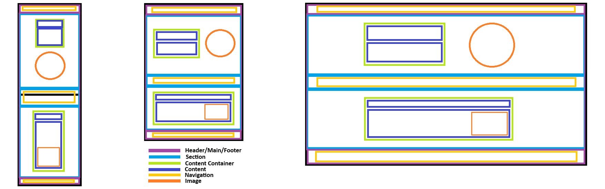

# Codecademy Portfolio Project

This is my personal **Codecademy Portfolio Project** built to showcase the web development skills I've acquired through Codecademy courses. The portfolio features several key projects, each demonstrating my ability to use various front-end technologies, including HTML, CSS, JavaScript, and more.

With a focus on clean design, responsiveness, accessibility, and interactivity, this portfolio reflects my growth as a developer, as well as my passion for creating engaging user experiences. The website is designed to be both visually appealing and fully functional across different devices.

## Key Highlights:

- **Low-Fidelity Wireframe**:

- **Fully Responsive**: This portfolio is built to be both visually appealing and fully functional across various devices.

- **Interactive Features**: JavaScript is used to enhance the user experience with interactive elements, including smooth transitions and animations.

- **Project Showcases**: Each project has a dedicated section where I explain the technologies used, challenges faced, and solutions implemented.

## How to use:

1. **Navigation**: Use the top navigation bar to quickly jump between sections or to contact me.

2. **Explore the Content**: Browse through each section to learn more about my work and experience.

3. **Interact with Projects**: Click on interactive links in the portfolio section to view project images and details about the technologies used.

## Technologies Used:

- Git
- Github
- HTML
- CSS
- JavaScript

## Future Updates:

This portfolio is an ongoing project, and I continue to update it with new work as I progress in my learning journey. **Please note that the projects that are on the portfolio are not real, I have made up the websites to add to the portfolio.**

## License:

You are free to clone, modify, and use this project for personal or educational purposes. However, the image of myself (kristie-headshot.jpg) is strictly personal and may not be used, modified, or distributed for any purpose.

If you'd like to use any part of this project for commercial purposes, please contact me for permission.
